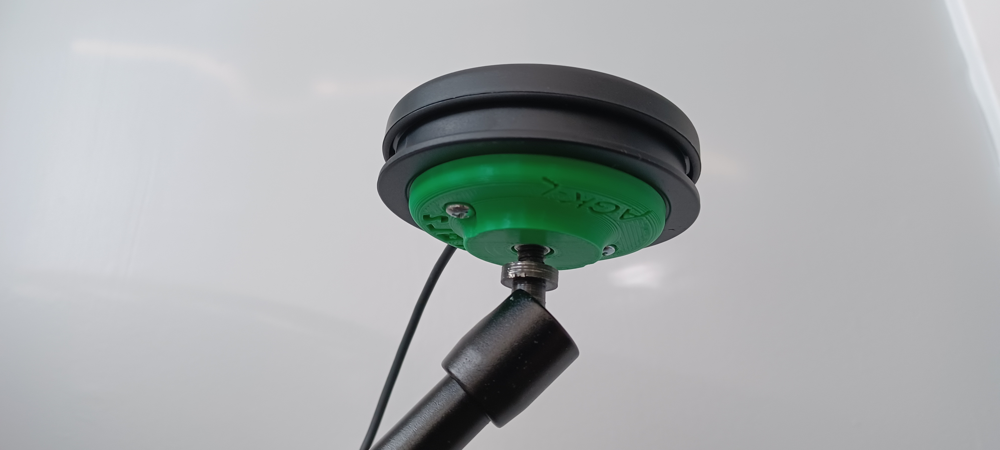

# Camera Mount Adapters for the Logitech Adaptive Gaming Kit

This Documentation covers information for both the full kit (12 adapters) and for a single adapter for one button.

The Camera Mount Adapters for Logitech Adaptive Gaming Kit are inexpensive, easy, and quick to build adapters for the four different Buttons from the [Logitech Adaptive Gaming Kit](<https://www.logitechg.com/en-ca/products/gamepads/adaptive-gaming-kit-accessories.943-000318.html/>). These adapters allow the buttons to be mounted on standard camera mounting equipment using the standard camera mount threads (¼”-20 UNC). These adapters were originally designed by [ATMakers](<http://atmakers.org/>) and more information on their switch mounts is available [here](<http://atmakers.org/2017/02/at-switch-adapters/>).

## More info at
- [Makers Making Change Project Page](<https://makersmakingchange.com/project/camera-mount-adapters-for-the-logitech-adaptive-gaming-kit/>)
- [Makers Making Change Forum Thread](<https://makersmakingchange.com/forum/topic/camera-mount-adapter-for-logitech-adaptive-gaming-kit/>)

## Getting Started

### 1. Order the Off-The-Shelf Components

The [Bill of Materials](/Documentation/Camera_Adapter_Logitech_BOM_V1.1.csv) lists all of the parts and components required to build the Camera Mount Adapter for Logitech Adaptive Gaming Kit. Everything can either be 3D printed or bought at the local hardware store. 

### 2. Print the 3D Printable components

All of the files and individual print files can be in the [/Build_Files/](/Build_Files/) folder.

### 3. Assemble the device.

Reference the [Assembly Guide](/Documentation/Camera_Adapter_Logitech_Assembly_Guide_V1.1.pdf) for the tools and steps required to build the devices.
## Files
### Documentation
| Document             | Version | Link |
|----------------------|---------|------|
| Design Rationale     | 1.0     | [Camera_Adapter_Logitech_Design_Rationale](/Documentation/Camera_Adapter_Logitech_Design_Rationale_V1.1.pdf)     |
| Bill of Materials    | 1.0     | [Camera_Adapter_Logitech_Bill_of_Materials](/Documentation/Camera_Adapter_Logitech_BOM_V1.1.csv)     |
| Assembly Guide       | 1.0     | [Camera_Adapter_Logitech_Assembly_Guide](/Documentation/Camera_Adapter_Logitech_Assembly_Guide_V1.1.pdf)     |
| Maker Checklist      | 1.0     | [Camera_Adapter_Logitech_Maker_Checklist](/Documentation/Camera_Adapter_Logitech_Maker_Checklist_V1.1.pdf)     |
| User Guide           | 1.0     | [Camera_Adapter_Logitech_User_Guide](/Documentation/Camera_Adapter_Logitech_User_Guide_V1.1.pdf)    |
| Changelog            | 1.0     | [Camera_Adapter_Logitech_Changelog](/Documentation/Camera_Adapter_Logitech_Changelog_V1.1.pdf)     |
| Summary              | 1.0     | [Camera_Adapter_Logitech_Summary](/Documentation/Camera_Adapter_Logitech_Summary_V1.1.pdf)     |

### Design Files
[CAD Files](/Design_Files)

### Build Files
 - [3D Printing Files](/Build_Files)

## Attribution
Designers:

[Original design](<https://www.thingiverse.com/thing:4128904>) created by [ATMakers](<http://atmakers.org/>) under the CC BY-SA 3.0 license.
Documentation, modified design, design files and build files created by Neil Squire / Makers Making Change under the CC BY-SA 4.0 license

## License
 Camera Mount Adapters for the Logitech Adaptive Gaming Kit by <a xmlns:cc="http://creativecommons.org/ns#" href="www.makersmakingchange.com" property="cc:attributionName" rel="cc:attributionURL">Neil Squire</a> is licensed under a <a rel="license" href="http://creativecommons.org/licenses/by-sa/4.0/">Creative Commons Attribution-ShareAlike 4.0 International License</a>.

## About Us

Makers Making Change is an initiative of [Neil Squire](https://www.neilsquire.ca/), a Canadian non-profit that helps people with disabilities.

We are committed to creating a network of volunteer makers who support people with disabilities in their communities through 3D printing assistive devices. Check out our library of free, open-source assistive technologies with parts and build instructions.

 - [www.MakersMakingChange.com](https://www.makersmakingchange.com/)
 - [GitHub](https://github.com/makersmakingchange)
 - [Thingiverse](https://www.thingiverse.com/makersmakingchange/about)
 - Twitter: [@makermakechange](https://twitter.com/makermakechange)
 - Instagram: [@makersmakingchange](https://www.instagram.com/makersmakingchange)

## Contact Us

For technical questions, to get involved, or share your experience we encourage you to visit the [MMC Project Page]( https://www.makersmakingchange.com/project), [MMC Forum](https://forum.makersmakingchange.com), or contact info@makersmakingchange.com
